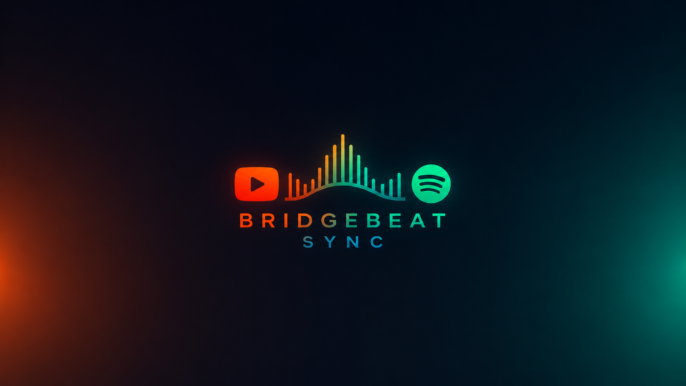
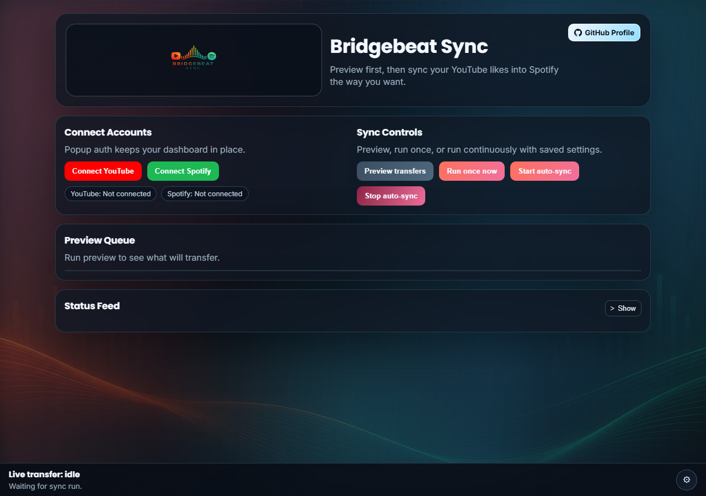

# Bridgebeat Sync

Sync your YouTube liked videos into your Spotify library in near real-time.



---

## What it does

- Connects YouTube and Spotify via OAuth (popup windows — dashboard stays open)
- Previews matched songs before committing any transfer
- Lets you choose where tracks go: Spotify Liked Songs, an existing playlist, or a brand-new playlist
- Controls transfer order: newest-first or oldest-first
- Optional playlist date-sort mode reorders by latest activity (YouTube like timestamp + Spotify saved-track timestamp)
- Paginates through your full YouTube likes history
- Runs as a one-shot sync or continuous auto-sync on a configurable interval

---

## Screenshots

### Dashboard — connect, preview, and sync controls



---

## Quickstart

### 1. Clone and install

```bash
git clone https://github.com/waynekosterjr-hub/Bridgebeat-Sync.git
cd Bridgebeat-Sync
npm install
```

### 2. Create API credentials

**Google / YouTube**

1. Go to [Google Cloud Console](https://console.cloud.google.com/) → APIs & Services → Credentials
2. Create an **OAuth 2.0 Client ID** (Application type: **Web application**)
3. Enable the **YouTube Data API v3** for your project
4. Add an authorized redirect URI:
   - HTTP: `http://localhost:3000/auth/youtube/callback`
   - HTTPS: `https://localhost:3000/auth/youtube/callback`
5. Copy your **Client ID** and **Client Secret**

**Spotify**

1. Go to [Spotify Developer Dashboard](https://developer.spotify.com/dashboard)
2. Create an app
3. Add a redirect URI:
   - HTTP: `http://localhost:3000/auth/spotify/callback`
   - HTTPS: `https://localhost:3000/auth/spotify/callback`
4. Copy your **Client ID** and **Client Secret**

### 3. Configure environment

```bash
cp .env.example .env
```

Open `.env` and fill in your credentials:

```env
GOOGLE_CLIENT_ID=your_google_client_id
GOOGLE_CLIENT_SECRET=your_google_client_secret
SPOTIFY_CLIENT_ID=your_spotify_client_id
SPOTIFY_CLIENT_SECRET=your_spotify_client_secret
SESSION_SECRET=any_random_string
APP_BASE_URL=http://localhost:3000
HTTPS_ENABLED=false
```

### 4. (Optional) Enable HTTPS

If you want HTTPS locally, generate a self-signed cert and update `.env`:

**Windows PowerShell**

```powershell
$pwd = ConvertTo-SecureString 'changeit123!' -AsPlainText -Force
$cert = New-SelfSignedCertificate -DnsName 'localhost' -CertStoreLocation 'Cert:\CurrentUser\My'
New-Item -ItemType Directory -Force certs | Out-Null
Export-PfxCertificate -Cert $cert -FilePath .\certs\localhost.pfx -Password $pwd
```

Then set in `.env`:

```env
HTTPS_ENABLED=true
APP_BASE_URL=https://localhost:3000
HTTPS_PFX_PATH=./certs/localhost.pfx
HTTPS_PFX_PASSPHRASE=changeit123!
```

**mkcert (any platform)**

```bash
mkcert -install
mkcert -key-file certs/localhost-key.pem -cert-file certs/localhost.pem localhost 127.0.0.1 ::1
```

Then set in `.env`:

```env
HTTPS_ENABLED=true
APP_BASE_URL=https://localhost:3000
HTTPS_KEY_PATH=./certs/localhost-key.pem
HTTPS_CERT_PATH=./certs/localhost.pem
```

### 5. Start the server

```bash
npm start
```

Open your browser to `http://localhost:3000` (or `https://localhost:3000` if HTTPS is enabled).

### Desktop mode

You can also run the app as a desktop application using Electron:

```bash
npm run desktop
```

This launches the local server in the background and opens the dashboard in a desktop window.

---

## How to use the app

### Step 1 — Connect YouTube

Click **Connect YouTube**. A popup opens asking you to sign in with Google and grant read access to your YouTube liked videos. Once authorized, the popup closes and the dashboard shows **YouTube: Connected**.

### Step 2 — Connect Spotify

Click **Connect Spotify**. A popup opens for Spotify login and permissions (library read/write, playlist management). Once done, the dashboard shows **Spotify: Connected**.

### Step 3 — Preview what will transfer

Click **Preview transfers**. The app fetches your recent YouTube likes, searches Spotify for each one, and populates the **Preview Queue** with matched tracks. Review the list — this doesn't save anything yet.

### Step 4 — Configure sync options (optional)

Click **Show** next to the sync options panel to expand settings:

| Option | What it does |
|---|---|
| **Destination** | Save to Spotify Liked Songs or a playlist |
| **Playlist** | Pick an existing playlist or create a new one (name it anything) |
| **Order** | Transfer newest likes first or oldest first |
| **Playlist date sort** | Reorder playlist by most-recently liked/saved, newest first |

### Step 5 — Run a sync

- **Run once sync** — transfers matched tracks immediately, then stops
- **Auto-sync every…** — runs continuously on the configured interval (default: 2 minutes), picking up new likes as you add them on YouTube

### Step 6 — Monitor progress

The **Status Feed** at the bottom logs each run: tracks found, matched, saved, and any errors. The **Live Transfer** bar at the bottom of the screen shows the current operation in real time.

### Step 7 — Stop auto-sync

Click **Stop auto-sync** at any time. Your Spotify library keeps everything already transferred.

---

## Tuning

| Environment variable | Default | Description |
|---|---|---|
| `SYNC_INTERVAL_SECONDS` | `120` | Seconds between auto-sync runs (minimum 30) |
| `YOUTUBE_MAX_ITEMS_PER_RUN` | `0` (unlimited) | Max liked videos to fetch per run |
| `SYNC_PROCESS_LIMIT` | `0` (unlimited) | Max new candidates to match/save per run |
| `SYNC_PREVIEW_LIMIT` | `150` | Max tracks shown in preview queue |
| `SPOTIFY_429_MAX_RETRIES` | `5` | Retry count for Spotify 429 responses |
| `SPOTIFY_DEBUG_DELAY_MS` | `0` | Extra delay before each Spotify API call (debug throttle) |

---

## Notes

- **Matching is heuristic** — video titles are cleaned and searched on Spotify. Some tracks may be unmatched or mismatched.
- **Session tokens** are stored locally in `data/sessions.json` (gitignored). You usually don't need to reconnect after a server restart.
- **Spotify re-auth** — if you connected Spotify before playlist features were added, reconnect to grant playlist scopes.
- **YouTube rate limits** — `YOUTUBE_MAX_ITEMS_PER_RUN` and `SYNC_PROCESS_LIMIT` help stay within API quotas.
